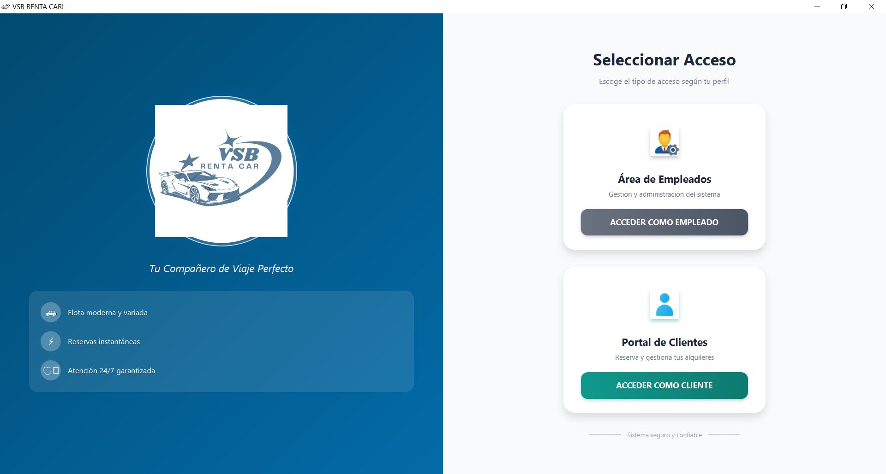
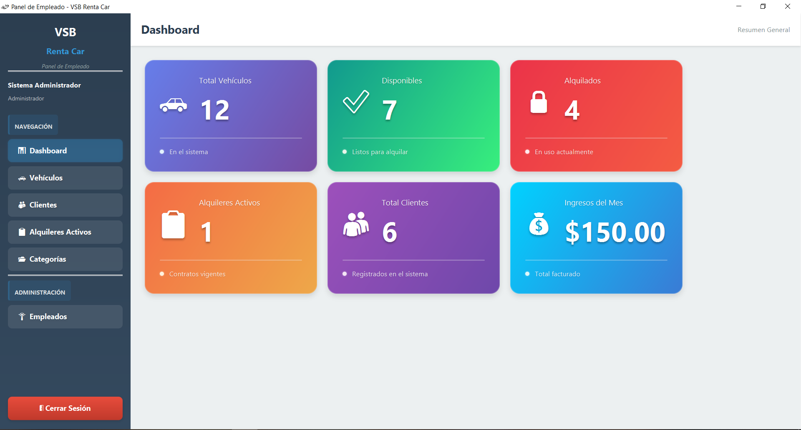

# VSB Renta-Car
##Vista de Inicio


## Vista de Cliente


## Vista de Administrador


**VSB Renta-Car** es un sistema de gestión de alquiler de vehículos
organizado por categorías. El proyecto ofrece dos tipos de acceso:
- **Clientes**, quienes pueden visualizar vehículos disponibles y
realizar solicitudes.
- **Empleados**, responsables de administrar el inventario, usuarios y
procesos de alquiler.

## Características principales

-   Gestión de vehículos por categoría.
-   Administración de alquileres y devoluciones.
-   Módulos separados para clientes y empleados.
-   Interfaz gráfica construida con JavaFX y Scene Builder.
-   Conexión estable con base de datos PostgreSQL.

## Tecnologías utilizadas

-   **JavaFX**
-   **Scene Builder**
-   **PostgreSQL**

------------------------------------------------------------------------

## Proceso de instalación

### 1. Obtener el proyecto

Tienes dos opciones:

-   **Descargar ZIP**:
    Desde el repositorio, selecciona **Code → Download ZIP**,
    descomprime el archivo y ábrelo en tu IDE.

-   **Clonar el repositorio**:

    ``` bash
    https://github.com/gonzalez1477/Renta-Car.git
    ```

------------------------------------------------------------------------

## 2. Base de datos (PostgreSQL)

### Crear la base de datos

1.  Abrir **pgAdmin**.
2.  Crear una base de datos con el nombre **rentacar_db**.

### Importar la base de datos

1.  En pgAdmin, clic derecho sobre *rentacar_db*.
2.  Seleccionar **Restore**.
3.  Escoger el archivo `.backup` o `.sql` incluido en el proyecto (si
    aplica).
4.  Ejecutar el proceso de importación.

La base de datos quedará lista para su uso dentro del sistema.

------------------------------------------------------------------------

## 3. Configurar la conexión a PostgreSQL

1.  Ir a la carpeta del proyecto:
    **/conexion/**
2.  Abrir la clase correspondiente, por ejemplo: `Conexion.java`.
3.  Configurar los datos según tu entorno local:

``` java
private final String URL = "jdbc:postgresql://localhost:5432/rentacar_db";
private final String USER = "tu_usuario";
private final String PASSWORD = "tu_contraseña";
private final String PORT = "5432"; // Modificar si tu PostgreSQL usa otro puerto
```

### Asegúrate de verificar:

-   Puerto del servidor.
-   Usuario configurado en PostgreSQL.
-   Contraseña correspondiente.
-   Que el servicio de PostgreSQL esté activo.


## Listo para ejecutar

Con la base de datos importada y la conexión configurada, el proyecto
puede ejecutarse desde tu entorno de desarrollo con soporte para JavaFX.

------------------------------------------------------------------------

## Creador del proyecto

**Victor Manuel Gonzalez Barrera**

------------------------------------------------------------------------
